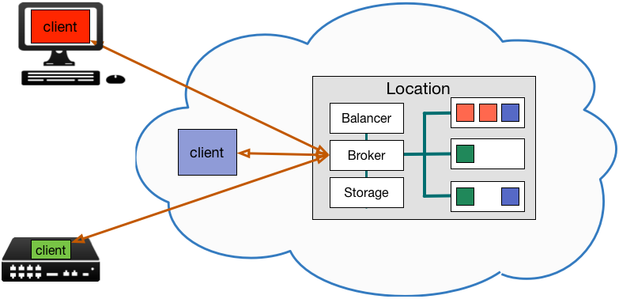

=================
20ft Architecture
=================

It is important to realise that 20ft doesn't have a central orchestrator and that orchestration is directed by client applications written against and SDK. Ultimately, using 20ft is a question of creating (and running) these client applications.

..  note::
    The the CLI tools are just *other* applications that use 20ft. They are also BSD licensed so you can incorporate them in your code however you want to. Particularly see the `tfnz command line utility <https://github.com/20ft/20ft/blob/3d435f552267fbb4d3472a0a274a8be0057bcd19/tfnz/cli/tf.py#L88>`_ as a reference for creating applications.

.. _external_architecture:

External Architecture
=====================

As a result of this, a client application needs to be running in order for a 20ft container application to run. The good news is that this application can run almost anywhere - and will behave identically no matter where it is deployed.

The 20ft cluster that these applications connect to is called a **Location**.

In this picture the red client is running on a developer's workstation, blue somewhere in the cloud, and green on an embedded/IoT device. They each are orchestrating what happens on the 20ft location, can build tcp tunnels to send data to and from individual containers, and can publish a cluster of containers to a domain on the load balancer.

We can also see that the nodes run containers from more than one client. However, containers are only visible to the session that created them, each has an independent IP and firewall, and a firewall on a container can only be opened by the creating session.

There is an exception for :ref:`discovering and connecting to services <service_discovery>` that is discussed later.

Security Architecture
=====================

20ft uses an `open source message queue <https://github.com/20ft/messidge>`_  running on tcp/2020 to communicate with a location. The message queue uses only public/private key pairs for identification and authorisation - hence each client has a public/private key pair (generated on the client itself) and the location also has a public/private key pair. At the start of a session the client and server authenticate each other and pass a session key to use for the remainder of the session. The combination of this session key and a plaintext nonce are used to encrypt each message. Since the server knows which session key belongs to which user, it marks the message has having been created by that user, and this 'cookie' is used wherever ownership needs to be asserted.

The security architecture is covered in more detail in :ref:`an appendix <security_architecture>`.

Internals
=========

..  note::
    You probably don't need to read this section. Having said that, an outline of 20ft internal architecture will help you understand what it *actually does*.

There are seven potential actors in a 20ft session: An account, a location, sessions, nodes, containers, volumes, and endpoints. The last two are optional

..  image:: _static/architecture.svg
    :align: center

Note that the greyed container is running on the node but is part of another session so is invisible.

Some definitions:

..  glossary::
    Account
        A locally created asymmetric key pair that enables the holder to connect to a 20ft location - usually held in ~/.20ft/. A client may have accounts for more than one location and a client account may be used by more than one client machine.

    Location
        A location is a single physical cluster or a collection of VPS's located within a single facility. The location runs a master that acts as an authenticator, a secured message broker, an image cache, a network manager, and a clearing house for resource offers.

    Session
        A single account may be connected to a location multiple times and each of these connections is called a session. Sessions have no visibility of or ability to interact with each other aside from connecting tagged containers.

    Node
        From an end user perspective the nodes are only able to spawn containers and destroy containers. In practice they have responsibilities for mapping volumes and configuring networks.

    Container
        Once spawned, a container is provided with a non-routable ip and default gateway. Containers can also have a TCP proxy mapped from the client machine onto a port, fetch and place files, enable connectivity from other containers, spawn additional processes, reset either with or without rolling back the disk image, and be accessed from an ssh/sftp session without needing to run additional software in the container itself.

    Volume
        A persistent ZFS dataset - can be snapshot and rolled-back. It is important to note that responsibility for backup of data on volumes remains with the user.

    Endpoint
        For publishing a load balanced cluster of containers to the public internet across an http(s) gateway.

What Happens When
=================

A typical 20ft session follows these steps:

* A background thread, responsible for delivering messages, streaming content and real-time updates, is started.
* The client initiates a `zmq <http://zguide.zeromq.org/page:all#ZeroMQ-in-a-Hundred-Words>`_ connection to the location using the location's public key, and sends some cryptographic parameters.
* The location authenticates and completes the `encryption <https://libnacl.readthedocs.io/en/latest/topics/public.html>`_ handshake.
* The location sends a resource offer - a statement of the resources available to this client (inspired by `Apache Mesos <http://mesos.apache.org/documentation/latest/architecture/>`_) and will continue to update the state of these resources. Note that the contents of this offer can be viewed as a json object using ``tfresources``. The location object is now ready and the main thread returns from its constructor.
* If using the ``tfnz`` CLI the client validates its parameters then ensures the location has a cache of the container's description and any layers needed to create the final container.

  * The local docker instance is queried to describe the container image. This description can be viewed as a json object using ``tfdescribe``.
  * If layers are missing from the layer cache they are uploaded from the client to the location.
  * If no local docker instance exists to provide the description of a container, a cached copy held in the location is used instead and succeeds if there are no additional layers to be uploaded.
  * If there is no cached description and no local docker instance the container will not be able to start. A ``docker pull`` may need to be issued manually.

* The location forms the root of an object model that can be scripted from Python 3. Callback messages arrive on a background thread.
* When the application quits (for any reason) the location will free any resources used *except* persistent volumes.

Conspicuous by it's Absence
===========================

Those familiar with existing container technology will notice a number of components missing from a traditional container solution. Let's quickly discuss these...

**Containers vs Pods**

The fundamental model in 20ft is that of a container - a single task in it's own virtual machine. However, pod like behaviour (multiple tasks in a single vm) can be implemented by:

* Explicitly spawning containers on the same node or...
* Starting a container 'asleep' and launching individual processes within the container as and when they are needed.

Note that at this time running systemd within a container is not supported.

**Port Mapping, Address Translation**

Simply not necessary - each container has it's own network stack and IP. Port mapping does occur, however, when exposing containers through a tunnel to localhost; and the requirement that the client side application has to be run with superuser privileges to open port numbers < 1024 remains in place.

**Block Storage**

20ft does not implement a shared block storage preferring instead to expose entire filesystems through NFS. We can use the snapshot and rollback facilities of ZFS from within the application.

.. _service_discovery:

**Service Discovery**

20ft does not run a KV store, dynamic DNS or similar service discovery mechanism.

* If a number of containers are delivered in a single session then the container objects may refer to each other freely.
* It is possible to create a proxy object for an external (tagged) container in another session by calling ``Location.external_container``.
* Services can be delivered through the web endpoint. The endpoint supports wildcard DNS entries, virtual hosts and SNI.

In the rare occasion where an actual IP is still required it can be obtained by calling ``Container.private_ip()``.

**Secrets Management**

Secret management is assumed to be within the purview of the client side application. Note that since 20ft can write into configuration files before a container starts, passwords, authorised keys, certificates etc can be pre-boot injected into a container and requires no further customisation.

**Auto Scaling**

Containers are efficient enough that merely spawning 'many' containers spread across a variety nodes is a valid solution - if they sit idle for 99% of the time, it really does not matter.

**A Docker Registry**

20ft caches images so provided a given image has been run *once*, it is ready to be started from any session. Note that this doesn't preclude the use of a docker registry, and that container images can still (and should) be backed up using ``docker save``.
