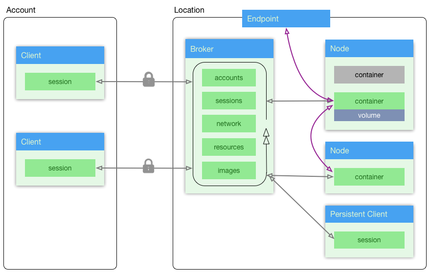

==========
The Basics
==========

Containers are basically virtual machines with low startup times. They almost all run on the x86-64 Linux ABI and are made with a Linux distribution as their base layer but are very rarely actually *booted*. They have access to a fast non-routable lan but little else; and are transient (i.e. losing all changes once the container is destroyed).

They are normally deployed to a container cluster: a collection of physical or virtual machines ("nodes"); each running an agent; and with a master that acts as a bastion onto the entire facility. Implementations of persistent storage vary and 20ft uses node-local storage (fast, simple).

Let's have a look at 20ft's specific implementation of this...

20ft Architecture
=================

There are eight potential actors in a 20ft session: An account, a location, sessions, nodes, containers, volumes, persistent containers and endpoints. The last three are optional

Grey lines are secured message passing interfaces, purple is internal only (and faster).

..  glossary::
    Account
        A pre-shared asymmetric key pair that enables the holder to connect to a 20ft Location - usually held in ~/.20ft/. A client may have accounts for more than one location.

    Location
        A location is a single physical cluster. The location runs a master daemon that acts as an authenticator, a secured message broker, an image cache, a network manager, and a clearing house for resource offers. It needs TCP port 5555 (inwards) to be open.

    Session
        A single account may be connected to a location multiple times and each of these connections is called a session. Sessions have no visibility of or ability to interact with each other. Client software needs to connect outwards to the Internet on TCP port 5555 and must be able to resolve DNS including TXT records.

    Node
        The nodes can spawn (create an instance of) containers and can map volumes into the container. They update the Location (and sessions) with the current state of their cpu, memory, disk io and free disk resources.

    Container
        Once spawned, a container is provided with a non-routable ip and default gateway. Containers can also create a TCP tunnel from (client) localhost onto a port, fetch and place files, enable connectivity from other containers, spawn additional processes, reset either with or without rolling back the disk image, and be accessed from an ssh/sftp session without needing to run additional software in the container itself.

    Volume
        A persistent ZFS dataset physically resident on a node - can be snapshot and rolled-back. It is important to note that responsibility for backup of data on volumes remains with the user.

    Persistent Session
        Exactly the same thing as a normal session except that it runs headless and on the infrastructure itself (in a container). Effectively a daemon process.

    Endpoint
        For publishing a load balanced cluster of containers to the public internet. Currently this is (only) an HTTP gateway.

What Happens When
=================

A typical 20ft session follows these steps:

* A background thread, responsible for delivering messages, streaming content and real-time updates, is started.
* The client initiates a `zmq <http://zguide.zeromq.org/page:all#ZeroMQ-in-a-Hundred-Words>`_ connection to the location using the location's DNS advertised public key, and sends some cryptographic parameters.
* The location authenticates and completes the `encryption <https://libnacl.readthedocs.io/en/latest/topics/public.html>`_ handshake.
* The location sends a resource offer - a statement of the resources available to this client (kudos to `Apache Mesos <http://mesos.apache.org/documentation/latest/architecture/>`_) and will continue to update the state of these resources. The location object is now ready and the main thread returns from it's constructor.
* If using the 'tf' CLI the client validates it's parameters then:

  * if passed a source ending with '.py' tries to import it as a function implementation, otherwise
  * it will see if the location has the source already cached and if not,
  * will retrieve it from the local docker instance and upload it.

* When the application quits (for any reason) the location will free any resources used *except* persistent volumes.

Conspicuous by it's Absence
===========================

Those familiar with existing container technology will notice a number of components missing from a traditional container solution. Let's quickly discuss these...

**Containers vs Pods**

The fundamental model in 20ft is that of a container - a single task in it's own virtual machine. However, pod like behaviour (multiple tasks in a single vm) can be implemented through a variety of means:

* Explicitly scheduling containers on the same node is trivial.
* Starting a node without an entrypoint and launching individual processes within the container as and when they are needed.
* Writing a short startup script - in most cases this will be able to call the existing startup scripts (i.e. 'apachectl') although at this time using systemd is not supported.

**Port Mapping, Address Translation**

Simply not necessary - each container has it's own network stack and IP. Port mapping does occur, however, when exposing containers through a tunnel to localhost.

**Block Storage**

20ft does not implement a shared block storage preferring instead to expose entire filesystems at the node local level. While this does lead to better performance and lower administration overhead it does mean that a little forethought is required relating to where the filesystem is instantiated. In a 20ft location there will always be at least one node with large storage - and the available storage is presented as part of the initial resource offer. Spawning a container on the same physical node as a volume is trivial.

**Service Discovery**

20ft does not run a KV store, dynamic DNS or similar service discovery mechanism. In the majority of cases the orchestration takes place within a single python and hence discovery becomes unnecessary. Address allocation is handled at the location and `Container objects <http://ref.html#container>`_ are able to connect to each other without the knowledge of their IP being necessary. In the case where an IP is needed (for setting parameters, option files etc) it can still be obtained by calling .ip on the object.

**Secrets Management**

Similarly to service discovery, secret management is assumed to be within the purview of the client side application. Note that (uniquely) 20ft can write into configuration files before a container starts meaning that passwords, authorised keys, certificates etc can be injected into a container before it starts and requires no further customisation of startup scripts. Incidentally: each container is firewalled off from the others by default.

**Auto Scaling**

Containers are efficient enough that merely spawning 'many' containers spread across a variety nodes is a valid and extremely performant solution - if they sit idle for 99% of the time, it really does not matter.

**An Orchestrator**

20ft does away with a traditional orchestrator in favour of explicit object instantiation and real-time delivery of status information. This means we don't need to use a DSL; have much greater control over failover procedures; can greatly reduce the latency associated with architecture changes and shorten the learning curve considerably.

**A Docker Registry**

20ft caches images so provided a given image has been run *once*, it is ready to be started from any session. Note that this doesn't preclude the use of a docker registry, and that container images can still (and should) be backed up using `docker save` and `docker load`.

**External IP's**

Are under development. Until then services can be delivered via a web endpoint.
