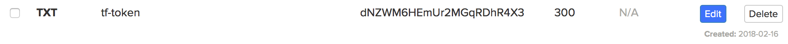
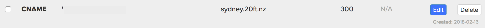

===========================
Administration from the CLI
===========================

20ft provides some simple CLI commands for administration of both server side and local resources. Note that in most cases the '--location' flag from tfnz can still be used to reference a location other than the current default.

Volumes
=======

Containers that destroy with the session are of limited usefulness without a way of persistently storing data. In 20ft this is done by mapping in an entire filesystem (volume) and not by providing block level access.

Volumes are managed with the 'tfvolumes' command: ::

    $ tfvolumes
    usage: tfvolumes [-h] [--location x.20ft.nz] [--local x.local]
                     {list,create,destroy} ...

    optional arguments:
      -h, --help            show this help message and exit

    connection options:
      --location x.20ft.nz  use a non-default location
      --local x.local       a non-dns ip for the location

    commands:
      {list,create,destroy}
        list                list available volumes
        create              create a volume
        destroy             destroy a volume

The 'location' and 'local' flags work the same as for 'tfnz'. The three commands are what you might expect. Let's create a volume: ::

    $ tfvolumes create
    wedHuVp6eWcyNGwk84fJya

tfvolumes returns the uuid of the volume that has just been created. We can list our volumes::

    $ tfvolumes list
    wedHuVp6eWcyNGwk84fJya

And destroy does what you would've thought::

    $ tfvolumes destroy wedHuVp6eWcyNGwk84fJya
    $ tfvolumes list
    $

Tagging
=======

The above example creates a volume that will be available to every container owned by the current user in the current location. However, distributing this uuid presents something of a problem. To get around this we are able to create a volume that can be referred to by a tag as well as its uuid::

    $ tfvolumes create postgres_data
    naZKTrhjrfMmYBnyWgfQEE:postgres_data

And the uuid appears marked with a tag. We can now refer to the volume by it's uuid, tag alone, or the uuid:tag pair. A quick example::

    $ tfvolumes list
    naZKTrhjrfMmYBnyWgfQEE:postgres_data
    wedHuVp6eWcyNGwk84fJya
    $ tfvolumes destroy postgres_data
    $ tfvolumes list
    wedHuVp6eWcyNGwk84fJya
    $ tfvolumes destroy wedHuVp6eWcyNGwk84fJya
    $ tfvolumes list
    $

.. _domains:

Domains
=======

Since 20ft webserves from a single IP (with virtual hosts and SNI) it is conceivable that one user could serve from a domain or subdomain owned by another. Consequently it's necessary to prove to 20ft that you own a certain domain. Follow these steps...

Let 20ft know you are starting the domain claiming process::

    $ tfdomains prepare example.com
    Put a DNS record on your domain: tf-token.example.com, TXT=dNZWM6HEmUr2MGqRDhR4X3
    ...then run: tfdomains claim example.com
    The request will time out (and become invalid) after six hours.

Add the TXT record to your DNS records held with your provider:

Let 20ft know when you have done this::

    $ tfdomains claim example.com
    Claimed successfully - you can remove the tf-token record from DNS
    $ tfdomains list
    example.com

20ft is now able to serve requests for that domain. Don't forget that you need a CNAME record pointing to the 20ft location itself. Note that you can use wildcard subdomains...

And you're good to go...::

    $ tfnz -w test.example.com nginx
    0217143629.588 INFO     Connecting to: sydney.20ft.nz:2020
    0217143629.643 INFO     Message queue connected
    0217143629.771 INFO     Handshake completed
    0217143629.975 INFO     Ensuring layers (3) are uploaded for: nginx
    0217143629.976 INFO     Spawning container: 2CD9yiZSod97KnQWrrXgdk
    0217143630.897 INFO     Container is running: 2CD9yiZSod97KnQWrrXgdk
    0217143630.897 INFO     ...startup time was: 0.876s
    0217143630.955 INFO     Published (K6QhA5mCKJGN4Q8TGtG6CF) at: test.example.com

Your claim to a domain can be released with ``tfdomains release example.com``.

.. _images:

Images
======

20ft does not run a traditional container image service, but instead caches two things: a description of the container to be built, and the layers needed to build the container. The rules around when 20ft will be able to run an image are:

* If running a local docker that is holding the required image, it will run.
* If not running a local docker but 20ft has previously run the image, it will run.
* If not running a local docker and 20ft has not previously run the image, it will **not** run.

..  note::
    It's important to note that 20ft will not issue a 'docker pull' for you, so if you want to run a public docker image it will need to be pulled onto your local machine first.

**tfcache**

It is possible to just ensure that 20ft has cached a particular image. This is especially useful as part of an automated build or CI/CD pipeline. Just call tfcache with the name of the image i.e. ``tfcache tfnz/silverstripe``.

**tfdescribe**

This just obtains, from your local docker instance, a json description of the of the requested image i.e. ``tfdescribe tfnz/silverstripe``. Note that this description is acually slightly different from the raw docker description in that it removes some duplicated elements.

Locations
=========

There are two utilties in support of 20ft accounts. To be precise, they are in support of the user identities, on a per-location basis, held in ~/.20ft/

**tflocations**

This is used to manage the locations you have identities for, and selecting which is the default location. Listing the locations...::

    $ tflocations list
    tiny.20ft.nz <== default
    sydney.20ft.nz

In this case shows that I have two identites for tiny.20ft.nz and sydney.20ft.nz. We can select which to use::

    $ tflocations select sydney
    $ tflocations list
    tiny.20ft.nz
    sydney.20ft.nz <== default

Note that 'select' uses a substring match so 'sydney' and 'sydney.20ft.nz' can both be used to select the Sydney location.

**tfresources**

This shows the resource offer made to an application when connecting to a given location::

    $ tfresources
    {
      "location": "tiny.20ft.nz",
      "nodes": {
        "EUhgvZ3ALDRhuHL2G03eVQfQK4igrltEiKG0n3/33kM=": {
          "memory": 15456.8515625,
          "cpu": 4000.0,
          "paging": 0,
          "ave_start_time": 0
        }
      },
      "volumes": [
        "ZQkG3mcBQnqxatgw8PLAk7:pycharm_helpers",
      ],
      "endpoints": [
        "20ft.nz"
      ]
    }

**tfacctbak**

This creates a shell script that will write the user identity into the filesystem when pasted into a shell. For example::

    $ tfacctbak
    echo 'mkdir -p ~/.20ft
    cat > ~/.20ft/sydney.20ft.nz << EOF
    Nl6CBYQnotmyrealkeyobviouslyxxxl0ybtf6ukP5g=
    EOF
    cat > ~/.20ft/sydney.20ft.nz.pub << EOF
    ULVaymypublickeyxxxxxxxxxxxxqztF/X6SOO3OYAQ=
    EOF
    cat > ~/.20ft/sydney.20ft.nz.spub << EOF
    Qhv4nqkyqbserverspublickeyV/Z6ZIl3HGKyzkxgA=
    EOF
    cat > ~/.20ft/default_location << EOF
    sydney.20ft.nz
    EOF

    chmod 400 ~/.20ft/sydney.20ft.nz*' | /bin/sh

So to enable another machine to use your account on a particular location, this can just be pasted into a shell. **This script includes your private key** and must not be stored, published or emailed.

The --location flag can be used to move the account for a non-default location.

Systemd
=======

**Systemd support is considered experimental at this stage and may be deprecated**. It exists to automate the process of running a 'tfnz' process as a systemd service on a remote server. The server must have a functioning 20ft environment installed including an account, and ssh access.

If we take the 'docs.sydney.20ft.nz' example, we could deploy it as a service using...

``tfnz --systemd admin@1.2.3.4 --identity ~/.ssh/admin.pem -w docs.sydney.20ft.nz tfnz/docs``

Being exactly the same as the tfnz call would've been otherwise except with the systemd and identity flags added. This will...

* Create a subdirectory of the user's home directory (~admin in this case) named with the slash in an image name replaced with a hyphen (tfnz-docs in this case).
* Creates the service file named similarly to the directory (tfnz-docs.service) in this directory and copies over the public/private keys if publishing to the web with ssl.
* Links the service file into /etc/systemd/system, reloads the systemd daemon and starts the service.

The resulting service can be started with systemctl start/restart/stop just like any other service.
