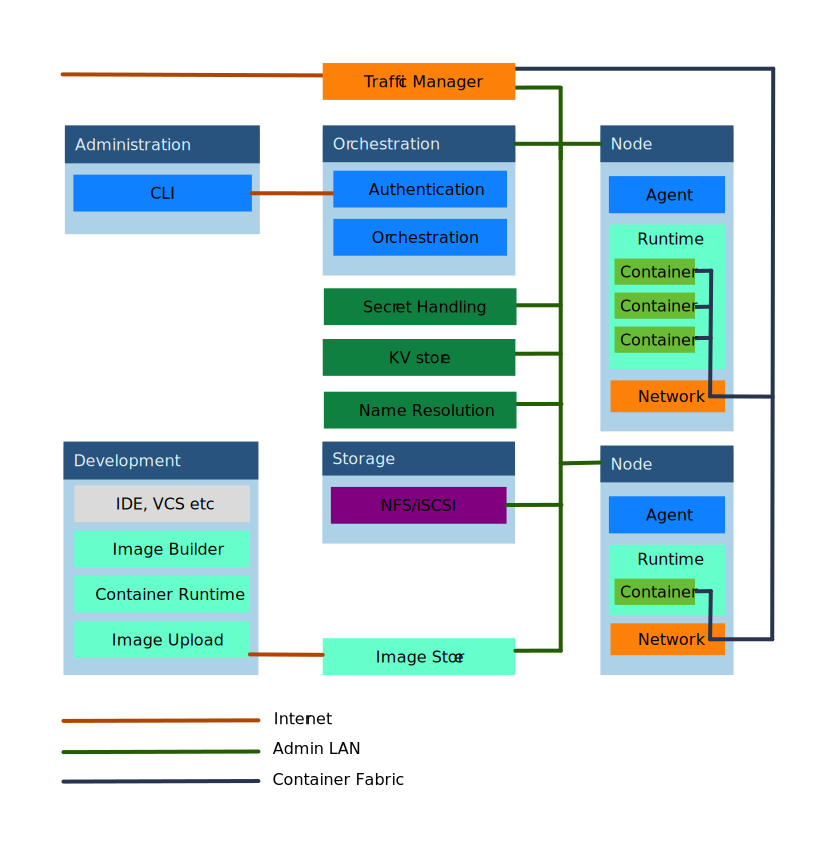
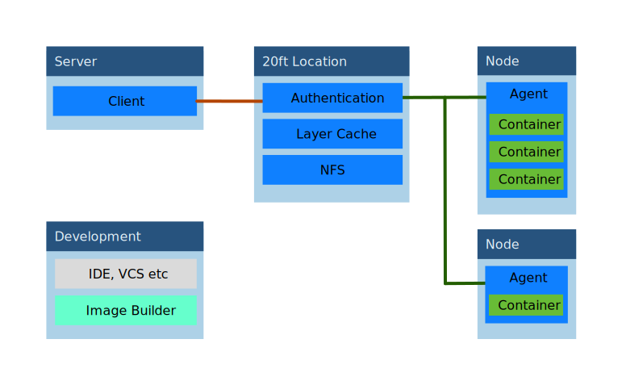

=======================
Deployment Architecture
=======================

This section is not required reading but will help in understanding the 'why' of 20ft.

Traditional Deployment Architecture
===================================

Below is a 'broad strokes' diagram of a traditional container deployment:

The major blocks are coloured to show the major subsystems and vendors: Runtime; Networking; Filesystem; Orchestration; and KV, Secrets and DNS are generally open to interpretation. There are clearly different opinions as to which parts belong to which vendor, but the overall position is one of a complex system with both a DMZ and an overlay network, and lots of interdependencies. They are challenging to install, challenging to administer, and near impossible to modify.

20ft Deployment Architecture
============================

20ft is different, it's architecture is this...

A couple of things to note:

* Clearly it is much simpler, and all the components are single sourced so there's no cross vendor integration taking place.
* The development tools are unchanged.
* It resides on a traditional 'DMZ with gateway' network, and is well suited to Amazon's VPC networking.
* The CLI and Orchestration processes have been replaced by a single "client".

This last point is important...
