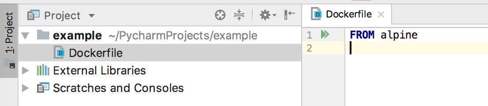
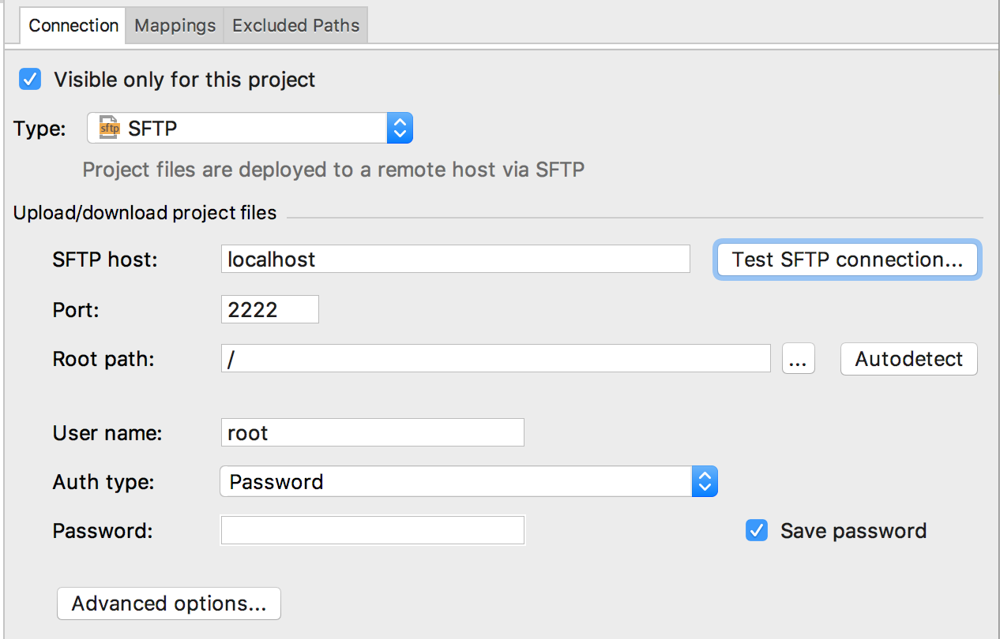
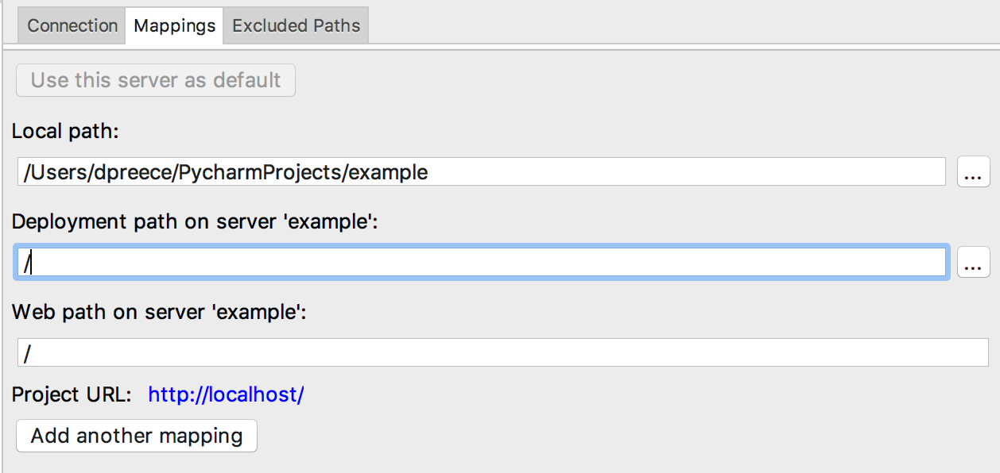
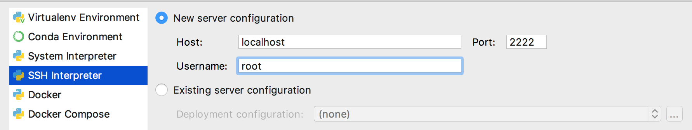
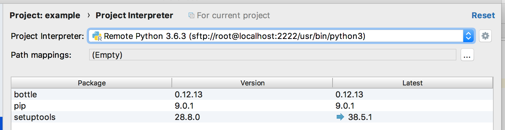
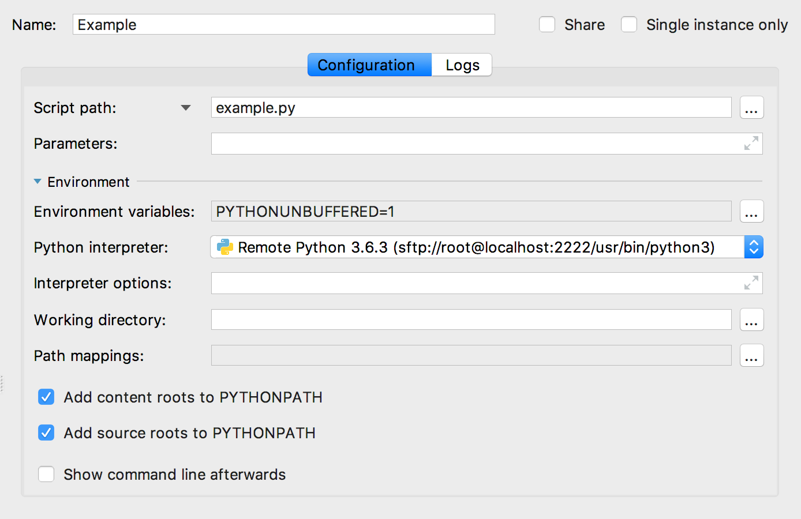
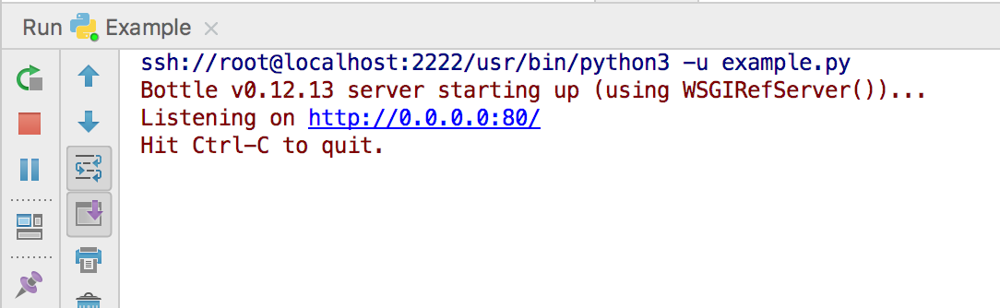

==================
Developing on 20ft
==================

This section is about developing *on* 20ft - i.e. purely as a container substrate. For development of 20ft applications, see the sections on `using the SDK <apps.html>`_.

In essence the day-to-day workflow with 20ft aims to be very much like developing for a remote vm, `using the ssh and sftp tools <cli.html#ssh-sftp>`_. The most significant differences are that there doesn't need to be an ssh/sftp server running inside the container, there's no need for login credentials, and that connections are always made to localhost.

..  note::
    The ssh/sftp facilities are primarily for debugging and are not suitable for production.

SSH/SFTP
========

To add an ssh/sftp server onto your container, run tfnz with '-s'...::

    dpreece@davermbp ~> tfnz -s alpine
    0222104211.862 INFO     Connecting to: tiny.20ft.nz:2020
    0222104211.912 INFO     Message queue connected
    0222104211.999 INFO     Handshake completed
    0222104212.337 INFO     Ensuring layers (1) are uploaded for: alpine
    0222104212.337 INFO     Spawning container: tqeU333dode4McgMpMmK9e
    0222104213.037 INFO     Container is running: tqeU333dode4McgMpMmK9e
    0222104213.039 INFO     ...startup time was: 0.667s
    0222104213.173 INFO     SSH server listening: ssh -p 2222 root@localhost

See that the command line needed is logged. Additional authentication is bypassed so any username/password will work. ::

    dpreece@davermbp ~> ssh -p 2222 root@localhost
    Welcome to Alpine!

    The Alpine Wiki contains a large amount of how-to guides and general
    information about administrating Alpine systems.
    See <http://wiki.alpinelinux.org>.

    You can setup the system with the command: setup-alpine

    You may change this message by editing /etc/motd.

    ctr-tqeU333dode4McgMpMmK9e:~#

Sftp works the same way: ::

    dpreece@davermbp ~> sftp -P 2222 root@localhost
    Connected to localhost.
    sftp> ls
    bin     dev     etc     home    lib     media   mnt     native  proc    root    run     sbin    srv     sys     system  tmp     usr     var

To run the ssh server on a non-default port, use '--ssh' then the port number as a command line flag.

Remote processes can be launched directly from the command line. 20ft will run the process inside a shell, and 'composite' instructions can be given to the shell: ::

    dpreece@davermbp ~> ssh -p 2222 root@localhost "uname"
    Linux
    dpreece@davermbp ~> ssh -p 2222 root@localhost "ping yahoo.com"
    PING yahoo.com (98.139.183.24): 56 data bytes
    64 bytes from 98.139.183.24: seq=0 ttl=52 time=231.634 ms
    64 bytes from 98.139.183.24: seq=1 ttl=52 time=230.580 ms
    64 bytes from 98.139.183.24: seq=2 ttl=52 time=229.590 ms
    64 bytes from 98.139.183.24: seq=3 ttl=52 time=232.669 ms
    ^CKilled by signal 2.
    dpreece@davermbp ~> ssh -p 2222 root@localhost "cd /usr ; ls -Fl"
    total 19
    drwxr-xr-x    2 root     root           139 Mar  3 11:20 bin/
    drwxr-xr-x    2 root     root             6 Mar  3 11:20 lib/
    drwxr-xr-x    5 root     root             5 Mar  3 11:20 local/
    drwxr-xr-x    2 root     root            38 Mar  3 11:20 sbin/
    drwxr-xr-x    4 root     root             4 Mar  3 11:20 share/

IDE Support
===========

The ssh server *should* be compatible with your ide of choice. Here I'm using PyCharm as a worked example, and we're going to build the `tfnz/env_test microservice <https://github.com/20ft/images/blob/master/env_test/report.py>`_ from scratch.

Let's start with an empty Alpine Linux container with an ssh server attached and a tunnel over to port 80::

    dpreece@davermbp ~> tfnz -s -p 8000:80 alpine
    0226163142.743 INFO     Connecting to: sydney.20ft.nz:2020
    0226163142.796 INFO     Message queue connected
    0226163142.923 INFO     Handshake completed
    0226163143.004 INFO     Ensuring layers (1) are uploaded for: alpine
    0226163143.004 INFO     Spawning container: LTYW4gxYBTzEJhSZdqLr6M
    0226163143.616 INFO     Container is running: LTYW4gxYBTzEJhSZdqLr6M
    0226163143.616 INFO     ...startup time was: 0.319s
    0226163143.617 INFO     Creating remote tunnel: J6e5kQHAtF5ctFx526FpmG (8000 -> 80)
    0226163143.755 INFO     SSH server listening: ssh -p 2222 root@localhost

And we'll create a "pure Python" project in PyCharm and start the Dockerfile:

We'll use the Dockerfile as a scratchpad to write down what we've done as we go along.

First, SSH into the container and start adding the software we will need. In Alpine's case always start with APK update::

    dpreece@davermbp ~> ssh -p 2222 root@localhost
    ctr-LTYW4gxYBTzEJhSZdqLr6M:/# apk update ; apk add python3
    fetch http://dl-cdn.alpinelinux.org/alpine/v3.7/main/x86_64/APKINDEX.tar.gz
    fetch http://dl-cdn.alpinelinux.org/alpine/v3.7/community/x86_64/APKINDEX.tar.gz
    ...[snip]...
    (11/11) Installing python3 (3.6.3-r9)
    Executing busybox-1.27.2-r7.trigger
    OK: 64 MiB in 22 packages
    ctr-LTYW4gxYBTzEJhSZdqLr6M:/#

Note this down in the Dockerfile as "RUN apk update ; apk add python3". We're also going to use the `Bottle framework <http://bottlepy.org/docs/dev/>`_ so we can add that with "pip3 install bottle" and make a note of that in the Dockerfile, too::

    ctr-LTYW4gxYBTzEJhSZdqLr6M:/# pip3 install bottle
    Collecting bottle
      Downloading bottle-0.12.13.tar.gz (70kB)
        100% |████████████████████████████████| 71kB 3.4MB/s
    Installing collected packages: bottle
      Running setup.py install for bottle ... done
    Successfully installed bottle-0.12.13

Create a Python file in the project (say, example.py) and put some code in. I'm just going to add `the report.py code <https://github.com/20ft/images/blob/master/env_test/report.py>`_ from tfnz/env_test::

    import os
    from bottle import route, run

    @route('/')
    def index():
        rtn = ""
        for env in os.environ.items():
            rtn += env[0] + "=" + env[1] + "\n"
        return rtn

    run(host='0.0.0.0', port=80)

And we add that to the Dockerfile as "COPY example.py /" - to copy this file into the root directory of the container.

OK. Now set up a deployment target in exactly the same way as you would for a normal remote debugging session (more info on `JetBrains' website <https://www.jetbrains.com/help/pycharm/remote-debugging.html>`_). Go Preferences...; Build, Execution, Deployment; Deployment. Remember we're using localhost:2222 as our SSH interface:

The password can remain blank and clicking "Test SFTP connection..." should confirm that this is all OK. We also need to add a mapping from the local directory where our project is to the path in the container where the software will be deployed - in this case just the root:

Apply, then clicking the green check mark above the list of deployment targets will mark this as being the default.

Next we need to tell PyCharm which Python interpreter to use. Go Preferences...; Project: example; Project Interpreter. See that it's currently assuming we're going to use the local interpreter? Click the cog next to the list of interpreters and click "Add", select "SSH Interpreter" and fill in the details as before.

On the next screen **correct the path to '/usr/bin/python3'** before clicking OK. You should end up with something like this - noting that Bottle shows as being installed.

Finally we need to create a run configuration. Click the configurations drop-down on the toolbar and select "Edit Configurations". Click the grey '+' on the left hand side and select a Python configuration. Fill in the form as before...

And we're pretty much ready to go. Upload 'example.py' to the container by right clicking on the file in the project view and selecting Deployment; Upload to example. Ignore the timestamp warning. Clicking the green "Run" button on the toolbar will start the software running in the container...

We can confirm this worked by curl'ing through the tunnel from our local machine::

    dpreece@davermbp ~> curl http://localhost:8000
    SHLVL=1
    PATH=/usr/local/sbin:/usr/local/bin:/usr/sbin:/usr/bin:/sbin:/bin
    PWD=/
    PYCHARM_HOSTED=1
    PYTHONUNBUFFERED=1
    PYTHONIOENCODING=UTF-8
    PYCHARM_MATPLOTLIB_PORT=50465
    JETBRAINS_REMOTE_RUN=1
    PYTHONPATH=/.pycharm_helpers/pycharm_matplotlib_backend:/Users/dpreece/PycharmProjects/example

Note "JETBRAINS_REMOTE_RUN" so we can tell this is running in the debugger.

So Make a Container
===================

While this is all *great*, the minute we close the container all our work will be lost. Fortunately we have been keeping track of our steps in the Dockerfile and all that remains is to define the command to be run when the container starts. Add a 'CMD' statement to the dockerfile telling it to *run the Python3 interpreter* and use the example.py file as input::

    FROM alpine
    RUN apk update ; apk add python3
    RUN pip3 install bottle
    COPY example.py /
    CMD python3 example.py

So from here it's a simple question of running ``docker build .``::

    dpreece@davermbp ~/P/example> docker build .
    Sending build context to Docker daemon  48.13kB
    ...[snip]...
    Successfully built 913e9ea7dbcf

And now we can run our container the same as before except replacing "alpine" with (also a ) "."::

    dpreece@davermbp ~> tfnz -s -p 8000:80 .
    0226175002.811 INFO     Connecting to: sydney.20ft.nz:2020
    ...[snip]...
    0226175020.117 INFO     Container is running: 99sLwZ4SutJ4uMoDut9AVn
    0226175020.117 INFO     ...startup time was: 3.943s
    0226175020.118 INFO     Creating remote tunnel: FZfiRWxtshhsTfvMPDP5xE (8000 -> 80)
    0226175020.252 INFO     SSH server listening: ssh -p 2222 root@localhost

Curl'ing from the command line shows the software is now running under a different environment::

    dpreece@davermbp ~> curl http://127.0.0.1:8000
    container_uuid=021c2776-290a-480d-a6ef-a8481933b730
    USER=root
    SHLVL=2
    HOME=/root
    NOTIFY_SOCKET=/run/systemd/nspawn/notify
    container=systemd-nspawn
    LOGNAME=root
    PATH=/usr/local/sbin:/usr/local/bin:/usr/sbin:/usr/bin:/sbin:/bin
    PWD=/

But, importantly, working. (this might be a good time to commit to version control)

Further Development
===================

..  note::

    **A quick but annoying aside** is that a container to be debugged may need 'socat' installed. This includes Alpine Linux, so we need to add 'socat' to our apk line in the Dockerfile - which now reads ``RUN apk update ; apk add python3 socat`` - and rebuild (``docker build .``)

    Another small annoyance is that now we have a working container, that spawning the container will cause it to start the process we were hoping to debug - including, in this case, locking the port we were hoping to use. We can fix this by adding a '-z' to the command line, causing the container to spawn 'asleep' (``tfnz -z -s -p 8000:80 .``). So, start the container asleep, and return to the example project in the IDE.

For some reason it has become necessary to report the container's uname as part of this environment service. So we'll add that to the returned string::

    @route('/')
    def index():
        rtn = ""
        for env in os.environ.items():
            rtn += env[0] + "=" + env[1] + "\n"
        rtn += os.uname()  # <====== the new bit
        return rtn

Start the container up from the command line (``tfnz -z -s -p 8000:80 .``), upload the new version of 'example.py', start with the 'run' button again, and curl the result::

    dpreece@davermbp ~> curl http://127.0.0.1:8000
    .......
                <title>Error: 500 Internal Server Error</title>
    .......

Oh dear, **not** what we were looking for. The console in the debugger lets us know why it failed::

    ssh://root@localhost:2222/usr/bin/python3 -u example.py
    Bottle v0.12.13 server starting up (using WSGIRefServer())...
    Listening on http://0.0.0.0:80/
    Hit Ctrl-C to quit.

    Traceback (most recent call last):
      File "/usr/lib/python3.6/site-packages/bottle.py", line 862, in _handle
        return route.call(**args)
      File "/usr/lib/python3.6/site-packages/bottle.py", line 1740, in wrapper
        rv = callback(*a, **ka)
      File "example.py", line 10, in index
        rtn += os.uname()  # <====== the new bit
    TypeError: must be str, not posix.uname_result
    10.1.0.2 - - [26/Feb/2018 08:21:10] "GET / HTTP/1.1" 500 741

All we do now is to add a breakpoint and use the 'debug' button on the toolbar instead of 'run' and it does exactly what we might hope...

..  note::
    **What's with "Checking PyCharm Helpers"?** PyCharm uploads a number of helper utilties so it can debug your container. Since we run the container 'fresh' every time, it needs to re-upload these utilities every time as well. You can avoid this by creating a 'pycharm_helpers' volume and launching with it mounted on /.pycharm_helpers (ie ``tfnz -z -s -m pycharm_helpers:/.pycharm_helpers .``)

..  warning::
    **There are some "issues" around debugging and ssh right now** and until they're sorted this section will remain "under construction", as they used to say.

