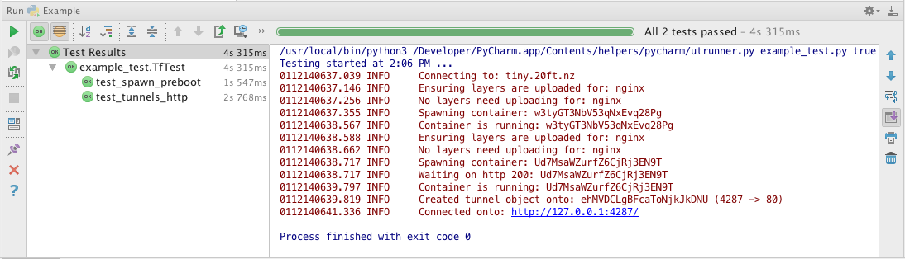

==========================
Example: Automated Testing
==========================

Unit Testing with PyCharm
=========================

PyCharm offers built in support for unit testing. Writing unit tests for containers on 20ft is no different from any other 20ft script. However, it's worth pointing out that the test case class can initialise itself just once, then use the resources in the remainder of the script. For example... ::

   import requests
   from unittest import TestCase, main
   from tfnz.location import Location

   class TfTest(TestCase):

       @classmethod
       def setUpClass(cls):
           cls.location = Location()
           cls.location.ensure_image_uploaded('nginx')

       def test_spawn_preboot(self):
           # write configuration files before we boot
           preboot = [('/usr/share/nginx/html/index.html', 'Hello World!')]
           container = TfTest.location.node().spawn('nginx', pre_boot_files=preboot, no_image_check=True)
           self.assertTrue(b'Hello World!' in container.fetch('/usr/share/nginx/html/index.html'))

       def test_tunnels_http(self):
           container = TfTest.location.node().spawn('nginx', no_image_check=True)

           # creating a tunnel after http 200
           tnl = container.wait_http_200()
           r = requests.get('http://127.0.0.1:' + str(tnl.localport))
           self.assertTrue('<title>Welcome to nginx!</title>' in r.text, 'Did not get the expected reply')

   if __name__ == '__main__':
       main()

So the Location object is created in a Pythonic (DRY) fashion, and the image is 'ensured' instead of being tested on every spawn.

To run this:

* Create a pure Python project in PyCharm.
* Add the script above.
* Select "Edit Configurations" from the toolbar.
* Click the '+' button to create a new configuration - select "Python tests -> Unittests"
* Enter the name of your script into the "Script" box, leave everything else alone.
* Click OK

You should now have a green 'Run' button next to the configuration, clicking it should create something like this:

