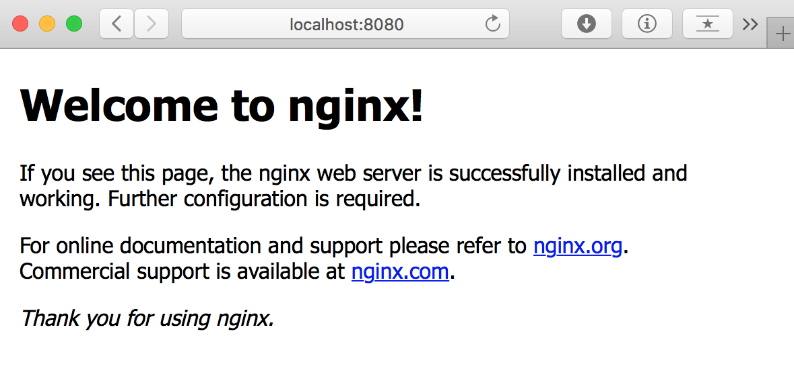

=========================
Playing Live with the SDK
=========================

The primary, fastest, and best interface onto 20ft is through the Python SDK. If you installed with ``pip3 install tfnz`` in the quickstart section then you've got the SDK installed and ready to go. If not, revisit the quick start section and follow the 'Python 3' path.

Using the SDK as a live coding environment is the best way to learn about 20ft and container technology in general. It is recommended that you use a more intuitive environment than the default python REPL for doing this. If you're using a graphical desktop and don't mind proprietary code then `PyCharm <https://www.jetbrains.com/pycharm/>`_ is highly recommended and will be used for examples in this chapter. For a text and/or resource constrained environment, `bpython-curses <https://www.bpython-interpreter.org>`_ (``pip3 install bpython``) is fun and *obscenely* fast.

Let's Go
========

From PyCharm, select Tools -> Python Console. When it appears, import the tfnz library with ``from tfnz import *``. Expanding the 'Special Variables' section shows what was just imported...

Close 'Special Variables' and connect to the default location with ``loc = location.Location()``, the debug view shows us the object as soon as it's constructed...

So here we see a Location object connected to 'sydney.20ft.nz' with two nodes. This object encapsulates a connection onto the location that is kept alive - and hence we won't need to reconnect or repeat the handshaking again. This is the primary reason the Python SDK is so fast.

A Container and a Tunnel
========================

Let's get the location to pick the best node for us then use that node to spawn an nginx container...

We can see that our 'loc' object has been joined by 'node' and 'ctr'. The container reports it spawned in under 1 second and is now running. Let's attach a tunnel and see if that is actually the case...

And...

Result! Removing the tunnel again shows a base precept of the SDK - which is that the object that creates something destroys it again. So, for example, we don't tell the tunnel to destroy - we tell the container to destroy the tunnel.

Note that the tunnel object doesn't disappear because the console itself is holding a reference. Just calling 'del' on the object removes it entirely - as can be seen from the variables window.
