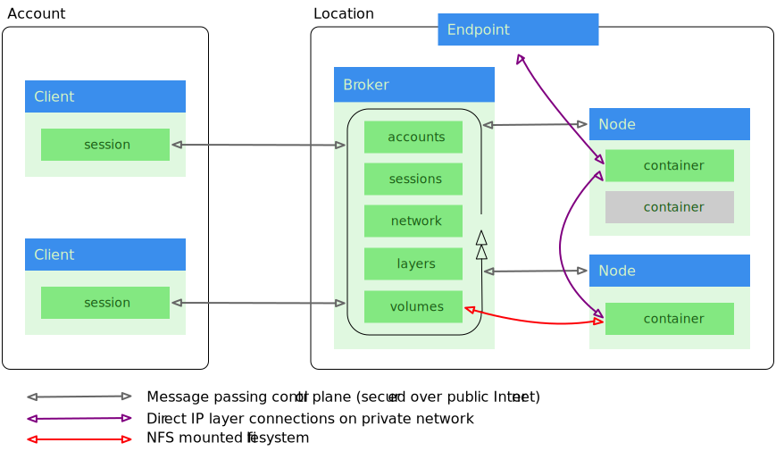

===============================
Appendix: Security Architecture
===============================

..  _security_architecture:

..  note::
    Knowledge of the security architecture is not necessary for using 20ft to its fullest. This is really information for those with sysadmin and infosec interests.

We briefly covered security architecture in an earlier chapter, but in the name of clarity let's look again at the 'detailed' view...

The client sessions are assumed to be on the public Internet (although likely behind an address translator), and the remainder of the infrastructure is inside a VPC or similar private network with the message broker and endpoint being the only parts exposed. Nodes and containers both have a default route through the broker, and neither is otherwise exposed. An administrator might like to open an ssh port for the administration of nodes, but this is in no way essential.

Data travelling across the VPC may be (and usually is) plaintext. 20ft messages travelling across the public Internet are always encrypted.

The messaging library is `open source <https://github.com/20ft/messidge>`_, as is the `cryptography library <https://github.com/pyca/pynacl>`_.

Accounts
========

Accounts are held on the broker in a SQL database. This consists of the account's PK, email address and a blob to hold generic properties. The broker does not hold private keys for accounts, and these private keys are generated locally on the client and hence cannot be captured while on the wire.

When an account is first created it is entered into a separate table of pending accounts, waiting for the client to authorise the account and publish the public key. This authorisation is by plaintext (on port 2021) but this is considered secure because: a valid and pending address would have to be guessed by an attacker; each 'pending' can only be used once so the attack is toothless once the account has been verified. There is a possibility of a race condition involving capturing the invitation email (which is transferred encrypted to the mail server) and authorising the account from an attacker's machine hence performing an account takeover. However, there would be no data associated with this account, and the fact that the legitimate account can not be authorised by its user would noticed.

Messages
========

As implied by the diagram, the 'core' of 20ft is a (non blocking) message loop. These messages are passed, nominally, using `Zero MQ <http://zeromq.org/>`_ on tcp/2020. Note that zmq's own authentication system was not used - it's fine for encrypting and authenticating but cannot then state with any certainty from which client a particular message arrived and this was viewed as a critical requirement.

When the client connects at tcp/2020 and zmq has finished its handshake, we do an encryption level handshake as thus:

* A message with the command 'auth' is sent with a claim to be a particular user - identified by their public key.
* The broker verifies that the user in question has an account (but does not fully authenticate) and returns a `cryptobox <https://nacl.cr.yp.to/box.html>`_ consisting of a new session key encrypted with both the server's private key and the client's public key.
* The client receives this cryptobox and can only open it if:

 * It genuinely has the private key that matches the advertised public key, hence ensuring client authenticity.
 * And if the server genuinely has the private key matching it's advertised public key, hence ensuring server authenticity.

* Messages can now be exchanged bi-directionally and at will. Each is encrypted with the session key proposed by the server, and a single use plaintext nonce.
* When a message arrives at the server, it is decrypted with the correct session key, then a 'user' parameter is set to indicate which client this message *must* have arrived from.

The nodes use exactly the same code, and mutually authenticate with the server. However, the server proposes a blank session key and this is taken to imply that the messages don't need to be further encrypted. In essence what we're saying is that since the nodes connect across a private network, that we won't encrypt the data on the wire.

Overlay Network
===============

20ft builds a simple, statically routed overlay network exclusively for use by the containers. This consists of:

* An internal bridge on each device.
* An CIDR of 10.x.0.0/16 for each device.
* A collection of GRE tunnels between each /16.
* Static routes along the GRE tunnels entered into the device's routing tables.
* A nat default route from the local /16 to the public internet via the device's public IP.

Hence we end up with a data plane network from a collection of /16's. When a container is created it:

* Creates a veth pair between the inside of the container and the local bridge.
* Sets the container's network namespace as having a firewall with:

 * A default drop for input packets.
 * A default drop for output packets headed to the local lan (with a whitelist for eg dns servers)
 * Accept for localhost and container local ip source addresses.
 * Accept for packets leaving via nat.
 * Allowances for packets returning from an established connection.

In it's initial state, the container cannot accept any externally sourced packets. When adding a 'connection' between two containers, both containers' (network namespaces) gain an additional firewall rule to allow packets sourced from each other to pass the firewall.

So isolation between users relies on one simple concept: that incoming packets are dropped unless we inform the firewall otherwise. There are no vlans, and firewalling decisions are made by the broker.

Endpoint
========

The endpoint is configured by the broker and proxies requests to the containers directly. The containers never need to connect *to* the proxy.

Storage
=======

Containers are unable to mount filesystems themselves and volume mounts are effected by the node prior to starting the container. A user mode client can mount an nfs server either held in another container or on the public internet - but not within the lan, and this prevents nfs from being mounted by anything other than software running on the node itself.

Layers
======

Similarly to storage, the layers are accessible to software running on the nodes themselves and not the containers. In order for a node to download a layer it needs to know the layer's sha256 but nothing else. Notably, the layer cache is shared between all users and in theory a carefully crafted request could extract a data layer for any user. However, this request would need to guess the 64 character sha256 for all layers before it would work.

External Firewalling
====================

The following ports must be exposed from the broker to the public Internet:

======== ======================================
tcp/2020 Entrypoint into the message loop.
tcp/2021 Plaintext account approval.
tcp/25   A tcp proxy to the mx for this domain.
tcp/80   http
tcp/443  https
tcp/22   An optional ssh server.
======== ======================================

In addition, these ports need to be open for packets originating inside the private network:

======== =================================
tcp/1025 A webserver for layer images.
udp/1026 A KV server for non aws installs.
tcp/2049 nfs
======== =================================

Note that the broker runs a `fail 2 ban <https://www.fail2ban.org/wiki/index.php/Main_Page>`_ instance watching the ssh server.

IAM Rights
==========

These are the IAM rights for the images running under AWS when built with the 20ft CloudFormation stack...

**Nodes** ::

    logs:CreateLog*
    logs:PutLog*
    logs:Describe*
    ssm:DeleteParameter
    ssm:DescribeParameters
    ssm:GetParameter*
    ssm:PutParameter
    cloudwatch:GetMetric*
    cloudwatch:ListMetrics
    cloudwatch:PutMetricData

**Broker** ::

    ec2:AllocateAddress
    ec2:AllocateHosts
    ec2:AssignPrivateIpAddresses
    ec2:AssociateAddress
    ec2:AssociateIamInstanceProfile
    ec2:AttachInternetGateway
    ec2:AttachNetworkInterface
    ec2:AttachVolume
    ec2:CreateNetworkInterface
    ec2:DeleteNetworkInterface
    ec2:Describe*
    ec2:DetachNetworkInterface
    ec2:DisassociateAddress
    ec2:ModifyInstanceAttribute
    ec2:ModifyNetworkInterfaceAttribute
    ec2:RebootInstances
    ec2:ReleaseAddress
    ec2:ReleaseHosts
    ec2:ReportInstanceStatus
    ec2:RunInstances
    ec2:StartInstances
    ec2:StopInstances
    ec2:TerminateInstances
    ec2:UpdateSecurityGroupRuleDescriptionsEgress
    ec2:UpdateSecurityGroupRuleDescriptionsIngress
    ec2:UnassignPrivateIpAddresses
    ec2:ReplaceIamInstanceProfile
    elasticfilesystem:*
    logs:CreateLog*
    logs:PutLog*
    logs:Describe*
    ssm:DeleteParameter
    ssm:DescribeParameters
    ssm:GetParameter*
    ssm:PutParameter
    cloudwatch:GetMetric*
    cloudwatch:ListMetrics
    cloudwatch:PutMetricData
    ec2messages:*
    ssm:UpdateInstanceInformation
    ssm:ListInstanceAssociations
    ssm:Describe*
    iam:PassRole

